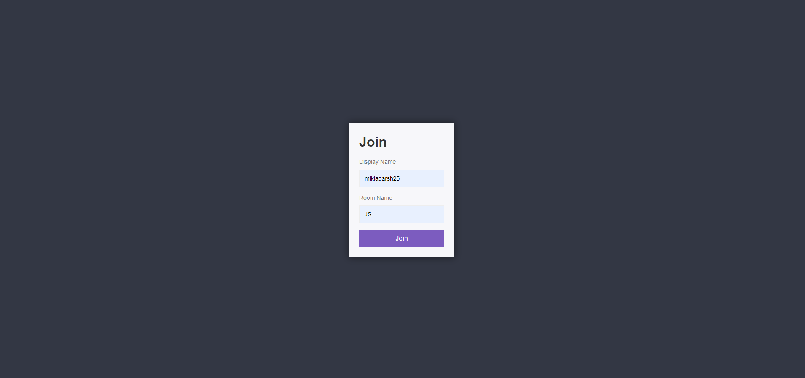
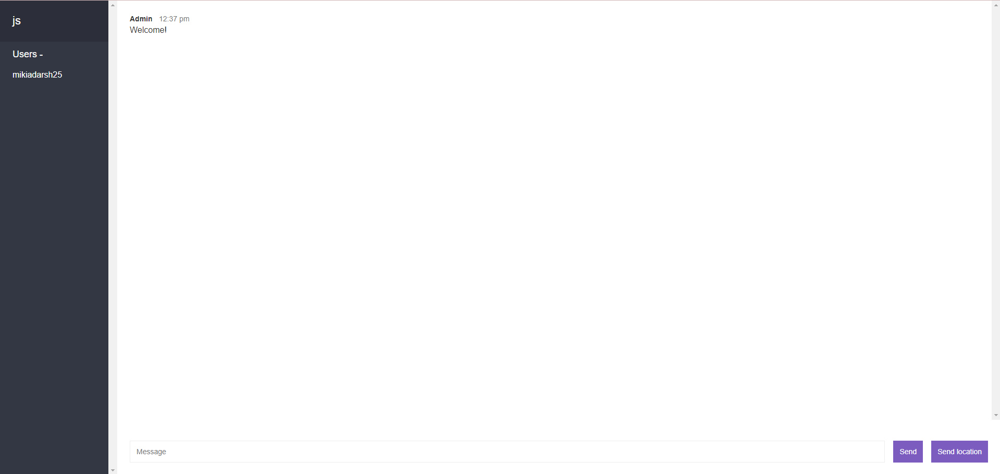

# 
Chat app is a software that enables users to exchange messages and communicate with each other in real-time. It allows groups to have conversations, share information, and collaborate instantly over the Internet.

## Join Page

## Chat Screen

### Instructions to run on local machine (Windows)

    git clone git@github.com:mikiadarsh25/chat-app.git
    git cd chat-app
    npm i package.json
    
(if it shows vulnerability or error run command)

    npm audit fix

Run command 

    npm run start

The website is running at localhost:3000

### Dependencies
**Backend**
1. NodeJs
2. ExpressJS
3. Socket.io
4. path
5. bad-words
6. Http

**Frontend**
1. HTML
2. CSS
3. JavaScript (Moment,Mustache, Qs)
